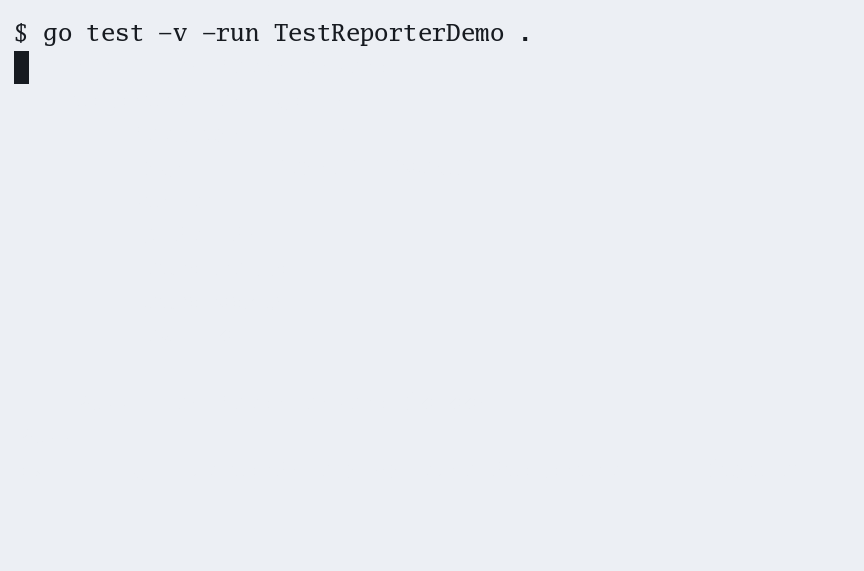

# colorcmp

A [`cmp.Reporter`](https://pkg.go.dev/github.com/google/go-cmp/cmp#Reporter) that uses [`znkr.io/diff`](https://pkg.go.dev/znkr.io/diff) to display differences between compared values with ANSI terminal colors.

<picture>
  <source media="(prefers-color-scheme: dark)" srcset=".github/demo-dark.gif">
  <source media="(prefers-color-scheme: light)" srcset=".github/demo-light.gif">
  
</picture>

## Installation

```console
$ go get github.com/stefanvanburen/colorcmp
```

## Usage

```go
reporter := colorcmp.New(os.Stdout)
cmp.Equal(x, y, cmp.Reporter(reporter))
fmt.Print(reporter.String())
```

In tests, pass `t.Output()` so color detection follows the test output stream:

```go
reporter := colorcmp.New(t.Output())
if !cmp.Equal(x, y, cmp.Reporter(reporter)) {
    t.Errorf("mismatch:\n%s", reporter.String())
}
```

## Example

```go
type Config struct {
    Name    string
    Retries int
    Tags    []string
}

x := Config{Name: "api", Retries: 3, Tags: []string{"prod", "east"}}
y := Config{Name: "api", Retries: 5, Tags: []string{"prod", "west"}}

var r colorcmp.Reporter
cmp.Equal(x, y, cmp.Reporter(&r))
fmt.Print(r.String())
```

Each line names the path to the difference — including slice indices and map keys:

```
Retries: -3 +5
Tags[1]: -"east" +"west"
```

Multi-line values (structs formatted as JSON, multi-line strings, and UTF-8 `[]byte`) diff line-by-line instead. When the output is connected to a terminal, deletions and insertions are colored red and green, as shown in the demo above.

## Environment variables

| Variable | Effect |
|---|---|
| [`NO_COLOR`](https://no-color.org) | Disables color output |
| [`FORCE_COLOR`](https://force-color.org) | Forces color output |
